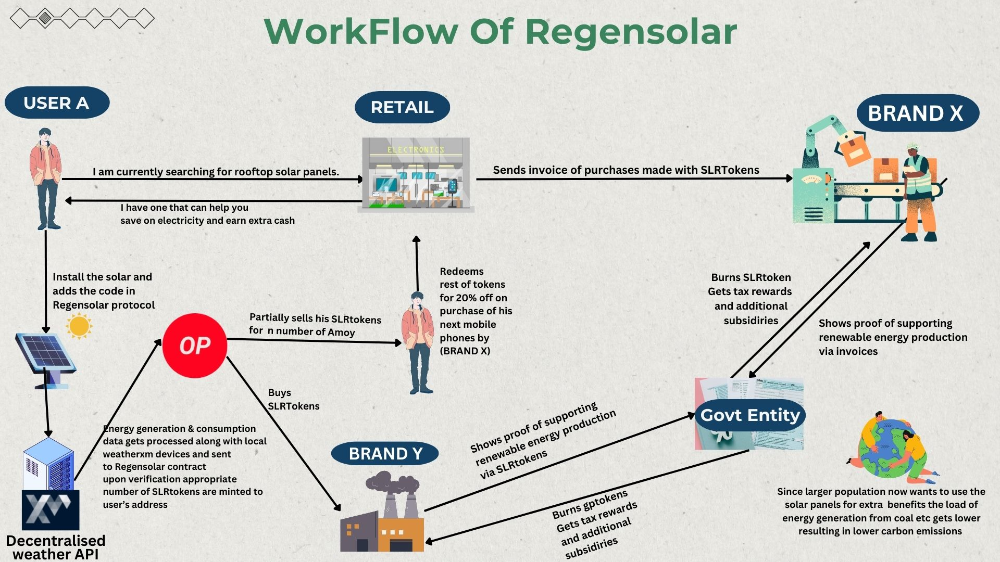

# RegenSolar ( DePin Network with Ecological benefits )

RegenSolar introduces an innovative ecosystem to accelerate the adoption and generation of renewable energy. With the GenSensor technology, individuals can attach smart sensors to their green energy sources, like solar panels, to track and convert energy production into digital tokens. This mechanism not only encourages renewable energy generation but also allows for the creation and trade of green energy certificates in our marketplace, promoting transparency and economic activity within the green energy sector. Addressing real-world problems, our project directly contributes to reducing the global carbon footprint by providing economic incentives for clean energy usage, thereby making green energy more financially attractive and accessible. Ultimately, our initiative empowers individuals to actively participate in a sustainable energy future, bridging the gap between renewable energy producers and consumers, and fostering a community committed to environmental stewardship.

# Workflow

# decentralized weather API Integration
- We are first fetching all the devices, then with the help of latitude and longitude, finding the nearest one. Then, we're fetching weather data from that particular local weather station. We are particularly interested in solar irradiance to help us calculate the valid maximum energy that could be generated by a solar panel. Based on that, we judge if our local sensors are tampered with to get an unfair number of tokens. We also reward users that submit their sensor's data along with nearby decentralized weather API device's data.

# Key Features

- **Alignment with Environmental and Social Outcomes:** Promotes renewable energy generation, which directly contributes to reducing the global carbon footprint, thereby supporting ecological sustainability.
  
- **Use of Blockchain and Transparency:**  The use of GenSensor technology to track energy production and convert it into digital tokens ensures transparency and traceability in energy generation and trading.
  
- **Tokenization and Marketplace Integration:** Converts energy production into digital tokens and facilitates the creation and trade of green energy certificates, enhancing market activity and efficiency.
  
- **Community Participation and Inclusivity:** Provides economic incentives for clean energy usage by making green energy financially attractive and accessible, encouraging wider adoption.

- **Economic Incentives for Sustainability:** Democratizes energy generation and consumption, creating a community of producers and consumers dedicated to promoting environmental sustainability.

- **Innovative Financial Instruments:** The use of digital tokens and green energy certificates represents innovative financial tools designed to support and accelerate renewable energy projects.

## Ecological Benefits

- Promotion of `Renewable Energy Generation`
- Economic Viability and `Incentives`
- Creation and Trade of `Renewable Energy Certificates`
- Reduction of `Carbon Footprint`
- Fostering Environmental `Governance`

RegenSolar's innovative ecosystem, utilizing GenSensor technology and digital tokens, significantly advances renewable energy generation while creating a transparent and economically viable marketplace for green energy. This approach drives substantial ecological benefits and aligns with global sustainability and environmental protection goals. By incentivizing clean energy production through digital tokens, RegenSolar promotes widespread adoption, reducing fossil fuel dependence and greenhouse gas emissions. Blockchain-enabled transparency enhances trust and accountability, ensuring a reliable market for green energy certificates. These efforts position RegenSolar as a leader in the clean energy revolution, contributing meaningfully to global carbon reduction and ecological sustainability.

# Arduino Setup
1. Download `Arduino Modules` .
2. Add `INA219 Sensor` for collecting data .
3. Serialize the connection to get data .
4. Tokens will be generated after Collecting Data .

## Getting Started

To get started with RegenSolar, follow these steps:

1. Clone the repository: `git clone https://github.com/akashbiswas0/ReFi-Hack`
2. Install dependencies: `npm install` then `npm run dev` for testing.
3. Configure your GenSensor devices (optional) and connect them to the RegenSolar platform.
4. Start tracking and converting renewable energy production into digital tokens.
5. Explore the Green Energy Token Marketplace and participate in trading activities.

